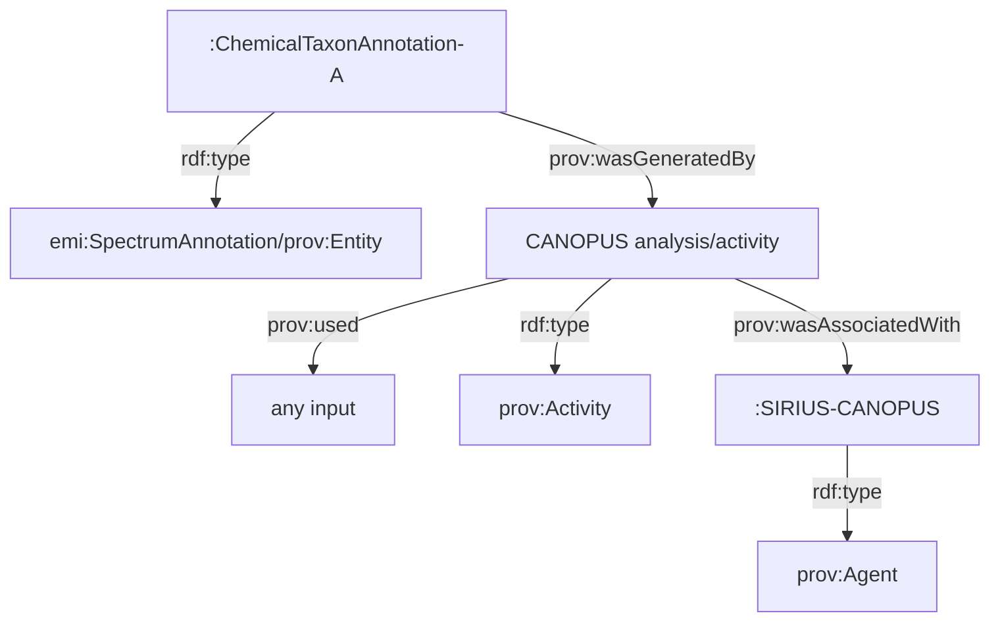
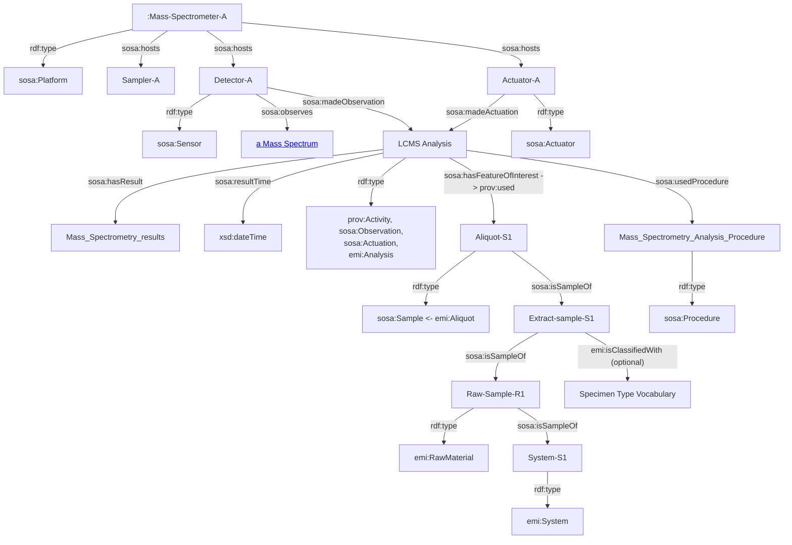
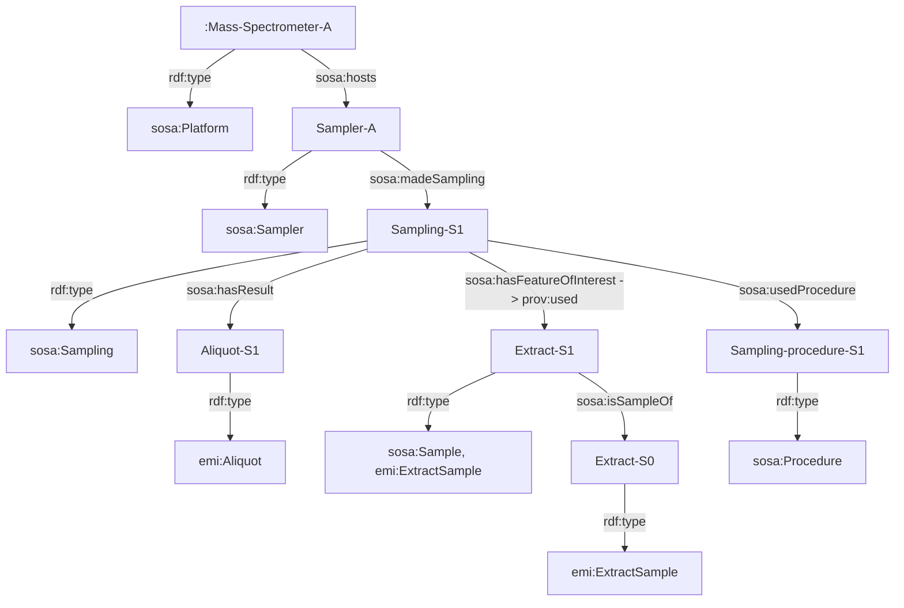
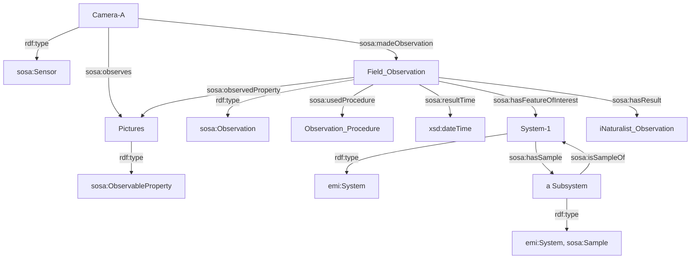
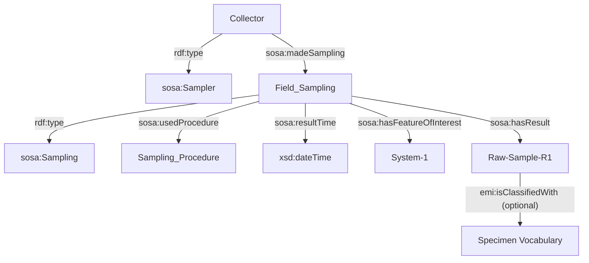
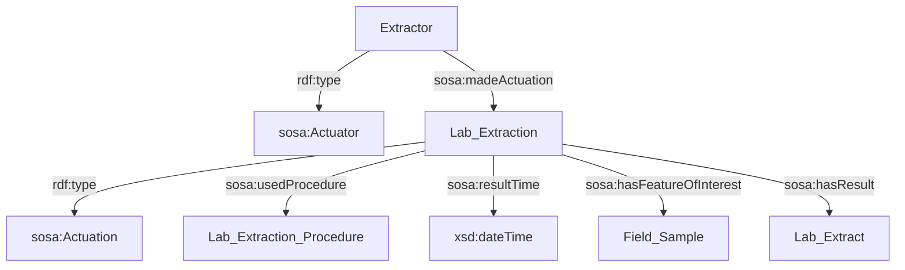
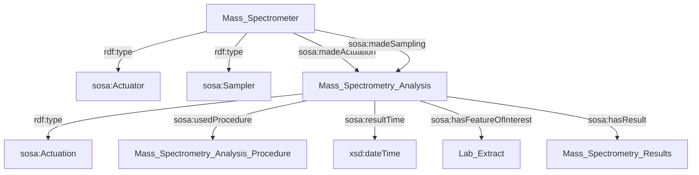

# Tutorial to generate RDF triples based on the EMI ontology

In this tutorial we will use a toy dataset and it requires mainly [MySQL](https://mysql.com) (version 8) and [Ontop](https://ontop-vkg.org) (version 5.1 or later) .

- Download the toy dataset in [ENPKG full](https://github.com/enpkg/enpkg_full)
- Download and install  
[MySQL 8.2](https://downloads.mysql.com/archives/community/) 
- To check, if MySQL was correctly installed 
```bash
mysql --version
```
- Install the Pipfile
```bash
cd scripts/sql_insert_emi_data
pipenv install
```
- If you do not have pipev, install it (see [more instructions](https://pipenv.pypa.io/en/latest/installation.html)
```bash
pip install pipenv --user
```
- In case you have any issue connecting check https://gist.github.com/zubaer-ahammed/c81c9a0e37adc1cb9a6cdc61c4190f52?permalink_comment_id=4473133

- From the root of this directory, create a database with the sql statements from raw_mysql_schema.sql into the MySQL server
```bash
mysql -u root -p < scripts/sql_insert_emi_data/raw_mysql_schema.sql
````
- You can connect to the database as shown below 
    
```bash
mysql -u root -p
```
- Check if the schema was created

```sql
show databases;
use emi_db;
show tables;
```
Alternatively, you can use the MYSQL Workbench to work with the emi_db database

```bash
mysql-workbench
```

**We observe that the structure_metadata (sqlite) is missing for now.**

- Edit the scripts/sql_insert_emi_data/config.py file and make sure that the path are pointing to the correct files.

## Allow for insertion in mysql

```bash
mysql -u root -p
```

```sql
SHOW VARIABLES LIKE "local_infile";
SET GLOBAL local_infile = 1;
SHOW VARIABLES LIKE "local_infile";
```
Loading local data is now enabled. To check it, you can run:
```sql
mysql> SHOW VARIABLES LIKE "local_infile";
+---------------+-------+
| Variable_name | Value |
+---------------+-------+
| local_infile  | ON    |
+---------------+-------+
1 row in set (0,01 sec)
```

## Get Ontop

- Download and unzip it from https://sourceforge.net/projects/ontop4obda/files/ontop-5.1.1/ontop-cli-5.1.1.zip/download

- Get MySQL JDBC driver  
We recommend to download the version mysql-connector-j-8.2.0.jar from the MySQL download archive at
https://downloads.mysql.com/archives/c-j/

- Move the mysql-connector-j-8.2.0.jar to the ontop-cli-5.1.1/lib folder
- Create ontop properties text file `./ontop_config/emi-v0_1.properties` such as the example below (change the url parameter if necessary)

```
jdbc.password=root
jdbc.user=root
jdbc.name=5e86f1b2-b7d8-4a17-9bc6-32b98b12ed79
jdbc.url=jdbc\:mysql\://localhost\:3306/emi_db
jdbc.driver=com.mysql.cj.jdbc.Driver
ontop.inferDefaultDatatype=True
```

- Run the ontop command line tool with the command below in the current directory. Please refer to the right path to the ontop tool 
```bash
PATH/TO/ontop-cli-5.1.1/ontop materialize -m ./ontop_config/emi-v0_1.obda -t ./ontop_config/emi-v0_1.ttl -p ./ontop_config/emi-v0_1.properties -f turtle --enable-annotations  --separate-files -o ./data/ontop
```
> **_NOTE:_**  you can allocated more memory to run ontop by editing the PATH/TO/ontop-cli-5.1.1/ontop file. For intance, `ONTOP_JAVA_ARGS="-Xmx16g"` instead of `ONTOP_JAVA_ARGS="-Xmx1g"`

> **_NOTE:_** If necessary you may need to specify the classpath for the mysql-connector-java .jar
```bash
export CLASSPATH=$CLASSPATH:/Applications/ontop-cli-5.1.1/lib/mysql-connector-java-8.2.0.jar
```


# Old notes EMI ontology


## Spectrum annotation provenance
To describe annotation provenace (i.e., information source), we are importing and applying the [PROV-Ontology](https://www.w3.org/TR/prov-o/) (a W3C reccomendantion). Below we show an application example to our knowledge domain:



# Organising Sample and Observation data

## Overview

As a suggestion, we can apply the [SOSA ontology](https://www.w3.org/TR/vocab-ssn/) as a data schema for struturing the Sample and Observation data. SOSA (Sensor, Observation, Sample, and Actuator) is a subset of SSN (Semantic Sensor Network Ontology) that is a W3C recommendation. Although the SSN  was developed with ontology engineers in mind as the primary audience. They addressed changes in scope and audience that currently also includes  scientific observations that may make heavy use of sampling strategies, and, therefore, the Sampling, Sampler, and Sample classes, as well as their corresponding properties, have been added to SOSA and SSN. 

## Data modelling proposal
Below, we show a concrete suggestion of how we could use this ontology for the EMI use case.

### Actuator-Sensor
We consider a Mass Spectrometer as a sosa:Platform. We interpret the MS detector that belongs to a Mass Spectrometer as being a Sensor. This sensor (a MS detector) is able to make an obervation by observing a Mass Spectrum (recommendation: to use the [CHMO controlled vocabulary]( http://purl.obolibrary.org/obo/CHMO_0000806)  as instances of the sosa:ObservableProperty).  Note that if we do not want to capture the equipment (Mass Spectrometer for provenance) of the generated LCMS analysis we can ignore/ommit them. The observation is interpreted as a [prov:Activity](https://www.w3.org/TR/prov-o/#Activity)/[sosa:Observation](https://www.w3.org/TR/vocab-ssn/#Observation)/emi:Analysis (the Analysis as defined in the Earth Metabolome Intiative model). This observation (aka LCMS Analysis) uses (prov:use/sosa:hasFeatureOfInterest) some sample. This sample comes from some emi:System (e.g. species or we can detail more here to be another sample like a Raw Material, a broader specimen). In addition, the LCMS analysis uses a Procedure (we can detail here the parameters etc used in the analysis). Finally, we can classify each Specimen by using some Specimen taxonomy such as in https://isamplesorg.github.io/models/generated/vocabularies/specimenType.html that relies on SKOS, similar to our other taxonomies in the project (NPClassifier) !

Moreover, we can also classify a sample with an external material taxonomy https://isamplesorg.github.io/models/generated/vocabularies/materialType.html#organicmaterial. All EMI model classes related to samples are subclasses of sosa:Sample, notably  emi:BlankSample, emi:ExtractSample and emi:QualityControlSample. 



The raw material (emi:RawMaterial) is also a sample/specimen. In case it is needed to describe the "Mass Spectrometer" as a sampler too, we can use the  sosa:Sampler class to define it as suggested below. (:Sampler-A) hosted by the :Mass-Spectrometer-A makes the sampling that resuts on subsamples (emi:Aliquot). The extract sample can be classified with an external taxonomy [such as the Specimen taxonomy ](https://isamplesorg.github.io/models/generated/vocabularies/specimenType.html) with the term emi:isClassifiedWith .



Detailed modelling of EMI actions


### Schema of an EMI Observation procedure



### Schema of an EMI Collection procedure


## Deprecated data modelling patterns
###  Schema of an EMI Extraction procedure (DEPRECATED)
(DEPRECATED: the same patterns from previous section can be applied by replacing the collector with the extractor. The extraction procedure is also a sampling procedure (i.e., it transforms one sample into another).



### Schema of an EMI Mass Spectrometry analysis procedure (DEPRECATED)
DEPRECATED - Please refer to [Actuator/Sensor modelling](#Actuator-Sensor)




### Schema of an EMI overall procedure (DEPRECATED)

```mermaid

graph TD

    subgraph field
    
    subgraph collection
		Collector -->|rdf:type|sosa:Sampler
		Collector -->|sosa:madeSampling|Field_Sampling["Field_Sampling"]
    Field_Sampling -->|rdf:type|sosa:Sampling["sosa:Sampling"]
    Field_Sampling -->|sosa:usedProcedure|Sampling_Procedure["Sampling_Procedure"]
    Field_Sampling -->|sosa:resultTime|fs_time["xsd:dateTime"]

    end 

    subgraph observation
		Smartphone -->|rdf:type|sosa:Sensor
		Smartphone -->|sosa:madeObservation|Field_Observation["Field_Observation"]
		Smartphone -->|sosa:observes|Pictures["Pictures"]
    Field_Observation -->|rdf:type|sosa:Observation["sosa:Observation"]
    Field_Observation -->|sosa:observedProperty|Pictures["Pictures"]
    Pictures --> |rdf:type|sosa:Observable_property["sosa:Observable_property"]
    Field_Observation -->|sosa:usedProcedure|Observation_Procedure["Observation_Procedure"]
    Field_Observation -->|sosa:resultTime|fo_time["xsd:dateTime"]
    Field_Observation -->|sosa:hasResult|iNaturalist_Observation["iNaturalist_Observation"]

    end

    Field_Observation -->|"sosa:hasFeatureOfInterest"|Living_System["Living_System"]
    Field_Sampling -->|"sosa:hasFeatureOfInterest"|Living_System["Living_System"]
    Living_System -->|skos:narrower|t_a["ex:Taxon_a"]
    Living_System -->|skos:narrower|t_b["ex:Taxon_b"]

    end
    
    Lab_Extraction -->|"sosa:hasFeatureOfInterest"|Field_Sample["Field_Sample"]
    t_a -->|rdf:type|w["<a href=http://www.wikidata.org/entity/Q16521>wikidata:Q16521</a>"]
    t_b -->|rdf:type|w["<a href=http://www.wikidata.org/entity/Q16521>wikidata:Q16521</a>"]
    t_a -->|"emi:isClassifiedWith (optional)"|w2["Specimen Type Vocabulary"]
    t_b -->|"emi:isClassifiedWith (optional)"|w2["Specimen Type Vocabulary"]

    Field_Sampling -->|sosa:hasResult|Field_Sample["Field_Sample"]

    subgraph lab


    direction TB
    subgraph mass_spectrometry
		Mass_Spectrometer -->|rdf:type|MS_Actuator["sosa:Actuator"]
		Mass_Spectrometer -->|rdf:type|MS_Sampler["sosa:Sampler"]
		Mass_Spectrometer -->|sosa:madeActuation|Mass_Spectrometry_Analysis["Mass_Spectrometry_Analysis"]
		Mass_Spectrometer -->|sosa:madeSampling|Mass_Spectrometry_Analysis["Mass_Spectrometry_Analysis"]
    Mass_Spectrometry_Analysis -->|rdf:type|MS_Actuation["sosa:Actuation"]
    Mass_Spectrometry_Analysis -->|sosa:usedProcedure|Mass_Spectrometry_Analysis_Procedure["Mass_Spectrometry_Analysis_Procedure"]
    Mass_Spectrometry_Analysis -->|sosa:resultTime|ms_time["xsd:dateTime"]
    Mass_Spectrometry_Analysis -->|sosa:hasResult|Mass_Spectrometry_Results["Mass_Spectrometry_Results"]
    end

    subgraph extraction
		Extractor -->|rdf:type|sosa:Actuator
		Extractor -->|sosa:madeActuation|Lab_Extraction["Lab_Extraction"]
    Lab_Extraction -->|rdf:type|sosa:Actuation["sosa:Actuation"]
    Lab_Extraction -->|sosa:usedProcedure|Lab_Extraction_Procedure["Lab_Extraction_Procedure"]
    Lab_Extraction -->|sosa:resultTime|xsd:dateTime
    Lab_Extraction -->|sosa:resultTime|le_time["xsd:dateTime"]

    end

    Lab_Extraction -->|sosa:hasResult|Lab_Extract["Lab_Extract"]
    Mass_Spectrometry_Analysis -->|"sosa:hasFeatureOfInterest"|Lab_Extract["Lab_Extract"]

    end

```





