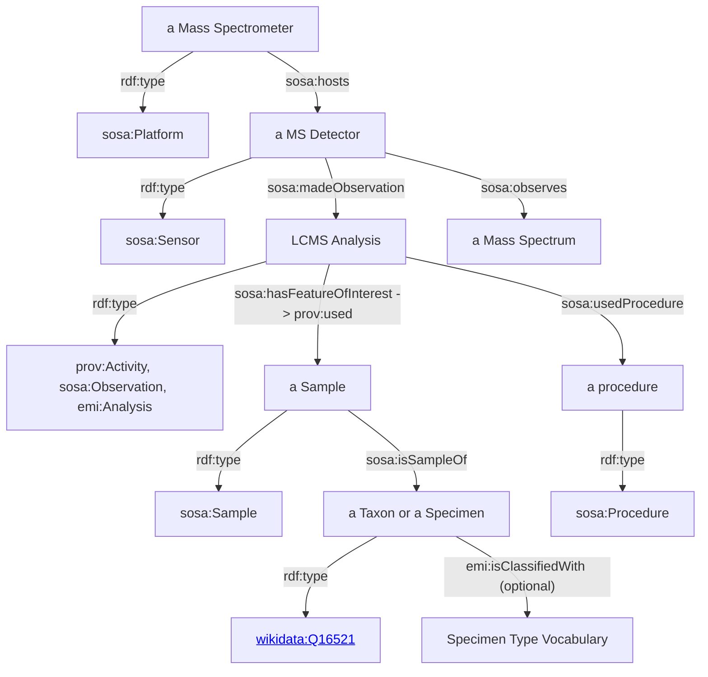

# Earth Metabolome Semantic Model
The first version of a draft of the Earth Metabolome semantic model is available in [`em.ttl`](em.ttl) that can replace the enpkg vocabulary. This model should import the [Natural Product taxonomy](#Natural_Product_taxonomy) described below. 

## Natural Product taxonomy
The [`npc_taxonomy.ttl`](npc_taxonomy.ttl) file is an SKOS-based OWL ontology for the structural classification of natural products derived from the [NPClassifier tool](https://pubs.acs.org/doi/10.1021/acs.jnatprod.1c00399). This OWL ontology was generated with the script in [`scripts`](scripts/natural_product_taxonomy).

This taxonomy is structured with the [SKOS vocabulary](https://www.w3.org/TR/skos-reference). `skos:broder` is used to represent the hierarchy among `Class`es, `Superclass`es and `Pathway`s.  `npc:Class`, `npc:Superclass` and `npc:Pathway` are subclasses of `skos:Concept`. `rdfs:label` is assigned for each term of the taxonomy that are instances of one of the subclasses of `skos:Concept`.

## Spectrum annotation provenance
To describe annotation provenace (i.e., information source), we are importing and applying the [PROV-Ontology](https://www.w3.org/TR/prov-o/) (a W3C reccomendantion).

`emi:SpectrumAnnotation` may assing the belown PROV-O properties:
`prov:wasAttributedTo` (range `prov:Agent`)
`prov:wasDerivedFrom`  (range `emi:InformationSource`)

# Organising Sample and Observation data

## Overview

As a suggestion, we can apply the [SOSA ontology](https://www.w3.org/TR/vocab-ssn/) as a data schema for struturing the Sample and Observation data. SOSA (Sensor, Observation, Sample, and Actuator) is a subset of SSN (Semantic Sensor Network Ontology) that is a W3C recommendation. Although the SSN  was developed with ontology engineers in mind as the primary audience. They addressed changes in scope and audience that currently also includes  scientific observations that may make heavy use of sampling strategies, and, therefore, the Sampling, Sampler, and Sample classes, as well as their corresponding properties, have been added to SOSA and SSN. 

## Data modelling proposal
Below, we show a concrete suggestion of how we could use this ontology for the EMI use case.

We consider a Mass Spectrometer as a sosa:Platform. We interpret the MS detector that belongs to a Mass Spectrometer as being a Sensor. This sensor (a MS detector) is able to make an obervation by observing a Mass Spectrum.  Note that if we do not want to capture the equipment (Mass Spectrometer for provenance) of the generated LCMS analysis we can ignore/ommit them. The observation is interpreted as a [prov:Activity](https://www.w3.org/TR/prov-o/#Activity)/[sosa:Observation](https://www.w3.org/TR/vocab-ssn/#Observation)/emi:Analysis (the Analysis as defined in the Earth Metabolome Intiative model). This observation (aka LCMS Analysis) uses (prov:use/sosa:hasFeatureOfInterest) some sample. This sample comes from some Taxon (species or we can detail more here to be a Specimen). In addition, the LCMS analysis uses a Procedure (we can detail here the parameters etc used in the analysis). Finally, we can classify each Specimen by using some Specimen taxonomy such as in https://isamplesorg.github.io/models/generated/vocabularies/specimenType.html that relies on SKOS, similar to our other taxonomies in the project (NPClassifier) !

Moreover, we can also classify a sample with an external taxonomy https://isamplesorg.github.io/models/generated/vocabularies/materialType.html#organicmaterial, in addition to the EMI model classes  emi:BlankSample, emi:ExtractSample and emi:QualityControlSample 

